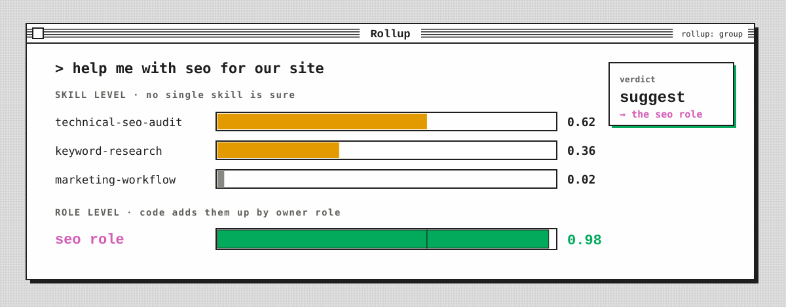

<a name="gatekeeper"></a>

# 

[](CHANGELOG.md)
[](https://github.com/AgriciDaniel/gatekeeper/actions/workflows/ci.yml)
[](LICENSE)
[](pyproject.toml)
[](https://docs.typesafe.ai/primitives)

**Gatekeeper decides which AI agent or skill should handle a request, before your AI picks one.** Commands you type go straight through; the plain requests, where the AI would otherwise guess, get checked by your rules and judged by Jev. Each decision costs a fraction of a cent and takes about half a second.

The engine and rulebooks are tool-neutral. Today it installs as a Claude Code hook.

<p align="left"></p>

A gate is a YAML rulebook. Code decides what code can decide (slash commands, keywords, field checks). [Jev](https://docs.typesafe.ai/primitives), TypeSafe's System One model, answers the one semantic question left ("which of these handlers owns this request?") as a typed Choice with a probability for every option. Confidence bands then turn that answer into a verdict:

| Verdict | Meaning |
|---|---|
| `allow` | Nothing to do, let it through |
| `route` | This handler. Confident enough to act on |
| `suggest` | Probably this handler. Advice only |
| `confirm` | Needs a human yes first (for example: deploy, send, delete) |
| `escalate` | Unsure. Ask the user who should handle it |
| `block` | Stop it |

Every hook decision is logged with the rules that fired, Jev's answers, the band, the cost and the rulebook version, so you tune thresholds from evidence instead of guessing.

## See it work

The `marketing-team` example routes marketing requests across 24 skills owned by 11 roles:

```text
$ gatekeeper judge marketing-team "our google ads cpc doubled, find the waste"
verdict:    route -> ad-account-audit
skill:      ad-account-audit conf 0.98 [act]
  group:    ads conf 1.0 [act]
  path:     skills/ad-account-audit/SKILL.md
decided by: decide:skill
message:    route: `ad-account-audit` (ads role, confidence 0.98). Read `skills/ad-account-audit/SKILL.md` and follow it.
cost:       $0.000056, 351 ms

$ gatekeeper judge marketing-team "help me with seo for our site"
verdict:    suggest -> seo
skill:      technical-seo-audit conf 0.59 [confirm]
  group:    seo conf 0.98 [act]
  path:     skills/technical-seo-audit/SKILL.md
decided by: decide:role
message:    this is seo work (confidence 0.98), but the exact skill is unclear (technical-seo-audit 0.62, keyword-research 0.36, marketing-workflow 0.02). Pick the narrowest seo skill whose "use when" fits, and say which one you chose.
cost:       $0.000056, 313 ms

$ gatekeeper judge marketing-team "rename this python variable"
verdict:    allow
skill:      not_marketing conf 1.0 [act]
  group:    not_marketing conf 1.0 [act]
decided by: decide:not-marketing
cost:       $0.000056, 311 ms
```

In the second prompt, no single skill is confident, but the skills it could be all belong to one role, so the gate still gives a useful answer. That is `rollup: group`: Jev picks the fine label and code adds up the probabilities by group.

<p align="left"></p>

## Two ways to use it

**1. Agent selection for Claude Code (`gates/agent-selection.yaml`).** The roster is whatever you have installed: `~/.claude/agents`, `~/.claude/skills` and your enabled plugins. Two hooks run it:

- **UserPromptSubmit** judges your prompt and adds the route as context.
- **PreToolUse** on `Agent`, `Task` and `Skill` denies a call that breaks a confident route or a `forbid` rule (in `enforce` mode only).

**2. Routing to Markdown procedures (`roster.sources: [index]`).** For setups where the assistant reads a `SKILL.md` and follows it instead of launching a subagent. The roster comes from a JSON index (name, description, group, path), and the gate runs in `advise` mode: it adds the route as context and never blocks. See [`examples/marketing-team/`](examples/marketing-team/).

## Install

```bash
git clone https://github.com/AgriciDaniel/gatekeeper.git && cd gatekeeper
pip install -e ".[test]"          # editable install from the clone; PyYAML, jsonschema, pytest
python3 -m pytest -q              # offline, no key needed
```

Gatekeeper runs from its checkout (rulebooks, examples and the local log live there), so install it editable as above; a plain `pip install .` is not supported. Run the installer below with the same Python you installed into: it writes that interpreter into the hook command.

Get a TypeSafe key and make it available in one of three ways: `export TYPESAFE_API_KEY=...`, point `GATEKEEPER_ENV_FILE` at an env file, or put `TYPESAFE_API_KEY=...` in `~/.config/gatekeeper/env` (a symlink to an existing env file works). Keep it out of the repo folder: the skill link exposes that folder under `~/.claude/skills`.

```bash
bin/gatekeeper judge marketing-team "write a welcome email sequence"    # try it
python3 scripts/install_hooks.py --global --skill                       # dry run: shows the change
python3 scripts/install_hooks.py --global --skill --apply               # hooks in ~/.claude/settings.json, /gatekeeper skill
bin/gatekeeper doctor                                                   # health check
```

A fresh install is in `shadow` mode: it logs what it would do and changes nothing. Watch `bin/gatekeeper log` for a few days, label a bench, then move up.

| Mode | Judges prompts | Adds context | Blocks or denies |
|---|---|---|---|
| `shadow` | yes | no (logs `would_inject`) | no |
| `advise` | yes | yes | never |
| `enforce` | yes | yes | yes |
| `off` | no | no | no |

Per-project logs: add `--home <folder>` to a `--project` install and that project's hooks log there instead of the shared `.gatekeeper/`.

Kill switch: `GATEKEEPER=off` in the environment, or `bin/gatekeeper mode agent-selection off`. Changing the mode of a shipped rulebook is saved in `gates/local/modes.json`, so your checkout stays clean. Uninstall: the same install command with `--uninstall --apply`. Every write to a settings file makes a backup first.

## Make it yours

Copy `gates/agent-selection.yaml` to `gates/local/agent-selection.yaml`. That folder is git-ignored and loaded first, so your roster, rules and bench stay private. Then:

- **Candidate rules** narrow the Choice when a keyword is certain: `when: {field: prompt, matches: '(?i)\bcanva\b'}` with `candidates: [canva-agent]`.
- **Forbid rules** take a handler off the table for matching prompts.
- **Families** let a hub use its own leaves without being denied.
- **Neutral** helpers (Explore, Plan, general-purpose, review skills) are never blocked, unless a rule explicitly forbids them.
- **A bench** (`{"prompt", "expect"}` per line, named in a `bench:` section or passed with `--file`) plus `bin/gatekeeper bench <gate>` tells you how accurate each band is and which act threshold keeps precision at your target.

Rules for editing a rulebook are in [SKILL.md](SKILL.md). The schema is [`gates/_schema.json`](gates/_schema.json).

## Safety rules the hooks always follow

- **Fail open means fully open.** If Jev is down or slow, nothing is denied, forbid rules included. A hook never breaks a session.
- **You outrank the gate.** A handler you name in the prompt ("ask the rust agent") is never denied.
- **Only your words are judged.** Harness messages (background agent results, task notifications, system reminders) match `passthrough`. They are not judged and never replace the turn's verdict.
- **Verdicts are per turn and per gate.** Each prompt clears the previous verdict. Verdicts expire after 2 hours and never cross sessions or gates.
- **Gatekeeper never acts.** It decides who handles work. It never sends, publishes, deploys or spends.

## Privacy and cost

In every mode except `off`, each judged prompt (up to 6000 characters) is sent to the TypeSafe API under your key, together with the fields the rulebook lists in `state` (the starter also sends the project folder name) and the roster's descriptions. Shadow mode included. Your TypeSafe key and common secret shapes (API keys, tokens, JWTs, private keys, credentials in URLs, `NAME_PASSWORD=...` lines) are masked first; that is best effort, not a guarantee. The local log (`.gatekeeper/`, git-ignored, readable only by you) stores a SHA-256 and a 120-character excerpt, not the full prompt. Slash commands, `!` shell escapes, harness messages and plain acknowledgements (yes, ok, thanks, go ahead) are decided by code and never sent.

Jev bills input tokens only. A judged prompt over a 24-skill roster costs about $0.00006; over 143 skills and workflows about $0.0004.

## Keeping it healthy

Because the gate fails open, a broken gate looks like a quiet one. `bin/gatekeeper doctor` checks for every known silent failure: a missing key, a retired pinned model, hooks that point at a moved folder, skill links left behind by a moved repo, a rising fail-open rate, harness messages that slip past `passthrough` after a Claude Code update, and a stale or unreviewed bench. `--offline` skips the two tiny live calls. `--json` and the exit code (1 on any failure) suit cron or CI.

## Layout

```
docs/assets/         README art (animated SVG, embedded OFL font subsets)
gates/               starter rulebook and the JSON schema
gates/local/         your private rulebooks and benches (git-ignored, loaded first)
examples/            marketing-team: index roster, rollup, advise mode, bench
gatekeeper/          engine, rules, bands, Jev client, roster, hooks, store, bench, doctor, CLI
scripts/             install_hooks.py
tests/               offline tests with recorded Jev responses
.gatekeeper/         local log, per-session state, bench reports (git-ignored)
```

## Status

v0.2.1. The starter thresholds (act 0.85, confirm 0.60 for Choice; 0.70 and 0.30 for Noul) are the documented illustrations from docs.typesafe.ai until your own bench over reviewed labels replaces them. The marketing-team bench scores 20 of 20, but its prompts are deliberately clear-cut: it shows the mechanics, not real-world accuracy. See [CHANGELOG.md](CHANGELOG.md).

Security reports: see [SECURITY.md](SECURITY.md). Contributions: see [CONTRIBUTING.md](CONTRIBUTING.md).

Requires Python 3.11+, PyYAML and jsonschema. Jev model, limits and prices change: check `GET https://api.typesafe.ai/v1/models` and docs.typesafe.ai before relying on them.
